# Pipeline ETL de Procesamiento de Entregas

Este proyecto contiene un pipeline ETL completo desarrollado en PySpark para la prueba técnica. La solución procesa datos de entregas de productos, aplicando una serie de transformaciones, validaciones de calidad y reglas de negocio, todo controlado de manera centralizada a través de un archivo de configuración.

## Entorno de Desarrollo y Dependencias

La solución fue desarrollada y probada exitosamente en el siguiente entorno de Databricks:

- **Databricks Runtime:** 17.0
- **Apache Spark:** 4.0.0
- **Python:** 3.11 (o la versión que corresponda a tu DBR)
- **Librerías Principales:** `pyspark`, `omegaconf`, `PyYAML`

### Estructura del Repositorio

```
├── config/
│   └── config.yaml          # Archivo de configuración (opcional, ya que el notebook lo genera)
├── data/
│   └── entregas_productos_prueba.csv # Datos de entrada
├── notebooks/
│   └── 20250723_etl_entrega_productos.ipynb # El notebook principal
├── LICENSE                  # MIT License
├── README.md                # Este archivo
└── requirements.txt         # Dependencias del proyecto
```

## Instalación

1.  Clona este repositorio en tu máquina local.
2.  Para configurar un entorno local de prueba, crea un entorno virtual e instala las dependencias:
    ```bash
    python -m venv venv
    source venv/bin/activate  # En Windows: venv\Scripts\activate
    pip install -r requirements.txt
    ```

## Cómo Ejecutar en Databricks

1.  **Subir los Datos:** Sube el archivo `data/entregas_productos_prueba.csv` al Databricks File System (DBFS) en la siguiente ruta:
    ```
    dbfs:/FileStore/etl_pipeline_final/bronze/
    ```

2.  **Importar el Notebook:** Importa el archivo `notebooks/Prueba_Tecnica_Final.py` a tu Workspace de Databricks. La plataforma lo convertirá automáticamente en un notebook con celdas.

3.  **Ejecutar el Notebook:** Abre el notebook importado, asegúrate de que esté adjunto a un clúster con un Runtime compatible (DBR 17.0 o similar) y ejecuta todas las celdas en orden.

## Descripción de la Solución

El notebook está estructurado en cuatro fases principales que demuestran el ciclo de vida completo del procesamiento de datos:

1.  **Configuración y Herramientas:** Se prepara el entorno, se genera dinámicamente el archivo de configuración `config.yaml` y se cargan las librerías.
2.  **Definición del Pipeline:** Se encapsula toda la lógica ETL en una clase `DataPipeline` para un código limpio y mantenible.
3.  **Ejecución del Pipeline:** Se orquesta la ejecución para múltiples escenarios (diferentes países y fechas) para probar la flexibilidad de la solución.
4.  **Auditoría de Resultados:** Se verifica que los datos procesados y los datos en cuarentena se hayan escrito correctamente en las carpetas de salida.

## Descripción Gráfica de la Solución

```mermaid
flowchart TD
    %% Definición de clases para styling
    classDef inputClass fill:#e1f5fe,stroke:#0288d1,stroke-width:2px,color:#000
    classDef processClass fill:#f3e5f5,stroke:#7b1fa2,stroke-width:2px,color:#000
    classDef outputClass fill:#e8f5e8,stroke:#388e3c,stroke-width:2px,color:#000
    classDef decisionClass fill:#fff3e0,stroke:#f57c00,stroke-width:2px,color:#000
    
    %% Subgrafo de Entradas
    subgraph INPUT [" 📥 ENTRADAS DEL PIPELINE "]
        direction TB
        A["📄 entregas_productos_prueba.csv<br/>🔹 <b>Datos Crudos de Entregas</b><br/>🔹 Formato: CSV"]
        B["⚙️ config.yaml<br/>🔹 <b>Reglas y Parámetros</b><br/>🔹 Configuración de Validación"]
    end
    
    %% Subgrafo de Procesamiento
    subgraph PROCESS [" ⚡ PROCESO ETL - PySpark/Databricks "]
        direction TB
        C["🔄 <b>1. Lectura y Carga de Datos</b><br/>📊 Spark DataFrame Loading"]
        D{"🔍 <b>2. Validación y Calidad</b><br/>📋 Data Quality Checks<br/>✅ Reglas de Negocio"}
        E["🔧 <b>3. Transformaciones de Negocio</b><br/>📅 Filtrado por fecha/país<br/>📏 Normalización de unidades<br/>📦 Clasificación de entregas<br/>🔤 Estandarización de columnas"]
    end
    
    %% Subgrafo de Salidas
    subgraph OUTPUT [" 📤 SALIDAS GENERADAS "]
        direction TB
        F["🗄️ <b>Datos Procesados (Silver)</b><br/>📁 Formato: Parquet<br/>🗂️ Particionado por fecha_proceso<br/>✅ Listos para Análisis"]
        G["⚠️ <b>Registros en Cuarentena</b><br/>📁 Formato: Parquet<br/>📝 Contiene motivo del rechazo<br/>🔍 Para Revisión Manual"]
    end
    
    %% Conexiones del Flujo Principal
    A --> C
    B --> C
    C --> D
    D -->|"✅ Registros Válidos"| E
    D -->|"❌ Registros Inválidos"| G
    E --> F
    
    %% Aplicar clases de styling
    class A,B inputClass
    class C,E processClass
    class D decisionClass
    class F,G outputClass
    
    %% Styling de subgrafos
    style INPUT fill:#f8f9fa,stroke:#343a40,stroke-width:3px
    style PROCESS fill:#f8f9fa,stroke:#343a40,stroke-width:3px
    style OUTPUT fill:#f8f9fa,stroke:#343a40,stroke-width:3px
```


